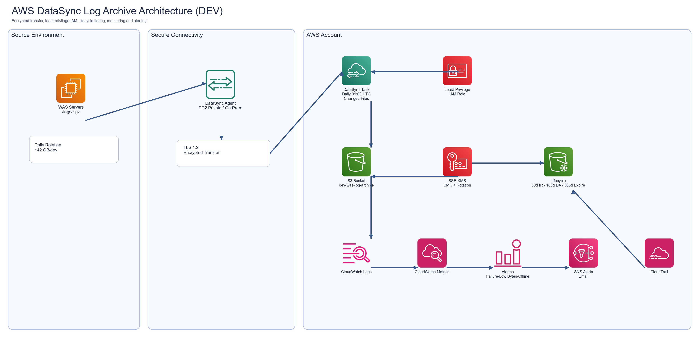

# DataSync WAS Log Archive (Terraform)

Production-ready Terraform implementation for secure, cost-optimized archival of WAS logs from EC2 or on-prem sources to Amazon S3 using AWS DataSync.

## Architecture

Source (WAS logs under `/logs/`) → DataSync Agent → TLS 1.2 transfer → S3 (`dev-was-log-archive`) with SSE-KMS → Lifecycle transitions to Glacier tiers → CloudWatch alarms + SNS notifications.



## What This Deploys

- KMS CMK with key rotation enabled.
- S3 archive bucket with:
  - Versioning enabled
  - SSE-KMS default encryption
  - Public access block (all true)
  - Bucket policy forcing TLS and SSE-KMS with the expected key
  - Lifecycle policy:
    - 30 days: Glacier Instant Retrieval
    - 180 days: Glacier Deep Archive
    - 365 days: Expire
- IAM least-privilege role for DataSync S3 destination access.
- DataSync agent registration, source location (NFS/SMB), S3 destination location, and daily scheduled task.
- CloudWatch log group and alarms:
  - Task execution errors
  - Daily bytes below threshold
  - Agent offline
- SNS topic and email subscriptions (optional).
- CloudTrail audit trail (optional, enabled by default).
- Optional EC2 deployment pattern for DataSync agent + optional S3 Gateway VPC endpoint for private transfer.

## File Layout

- `terraform/main.tf`
- `terraform/variables.tf`
- `terraform/outputs.tf`
- `terraform/iam.tf`
- `terraform/s3.tf`
- `terraform/datasync.tf`
- `terraform/cloudwatch.tf`
- `terraform/kms.tf`
- `terraform/.terraform.lock.hcl`
- `diagrams/architecture.png`
- `python/generate_aws_icon_architecture_png.py`
- `python/generate_aws_architecture_diagram.py`

## Prerequisites

- Terraform `>= 1.5`
- AWS provider `>= 5.x`
- AWS credentials with permissions to create IAM, S3, KMS, DataSync, CloudWatch, SNS, CloudTrail, EC2 (if using optional EC2 agent pattern)
- A deployed and reachable DataSync agent activation key (`datasync_agent_activation_key`)

## Example terraform.tfvars

```hcl
aws_region                     = "us-east-1"
s3_bucket_name                 = "dev-was-log-archive"
datasync_agent_activation_key  = "activation-key-from-agent"
source_environment             = "ec2"     # ec2 | onprem
source_type                    = "NFS"     # NFS | SMB
source_server_hostname         = "10.10.20.15"
source_subdirectory            = "/logs/"
datasync_s3_subdirectory       = "/"
datasync_schedule_expression   = "cron(0 1 * * ? *)"
include_filters                = ["*.gz"]
bandwidth_limit_bps            = -1
minimum_expected_bytes_daily   = 30000000000
enable_sns_alerting            = true
sns_email_endpoints            = ["platform-alerts@company.com"]

# Optional EC2 private-agent pattern
create_ec2_agent               = false
datasync_agent_ami_id          = "ami-xxxxxxxx"
vpc_id                         = "vpc-xxxxxxxx"
private_subnet_id              = "subnet-xxxxxxxx"
private_route_table_ids        = ["rtb-xxxxxxxx"]
source_cidr_blocks             = ["10.10.20.0/24"]
create_s3_gateway_endpoint     = true
```

For SMB sources, also set:

```hcl
smb_domain   = "CORP"
smb_username = "datasync-user"
smb_password = "REPLACE_ME"
```

## Deploy

```bash
cd terraform
terraform init
terraform fmt -recursive
terraform validate
terraform plan -out tfplan
terraform apply tfplan
```

## Security Controls Mapped

- **Least privilege IAM**: DataSync role permits only:
  - `s3:PutObject`
  - `s3:AbortMultipartUpload`
  - `s3:GetBucketLocation`
  - `s3:ListBucket`
  - `kms:Encrypt`
  - `kms:GenerateDataKey`
- **No wildcard resource scope** in IAM role policy statements.
- **Encryption in transit**: enforced by AWS service path + bucket `aws:SecureTransport` deny policy.
- **Encryption at rest**: default SSE-KMS + deny for missing/wrong KMS headers.
- **No public exposure**: S3 public access block all enabled.
- **Governance**: CloudTrail enabled; tags applied to all resources.

## DataSync Task Behavior

- Schedule: Daily at `01:00` UTC (`cron(0 1 * * ? *)`)
- Verify mode: `ONLY_FILES_TRANSFERRED`
- Overwrite mode: `NEVER`
- Preserve deleted files: `REMOVE` (preserve deleted OFF)
- Transfer mode: `CHANGED`
- Queueing: enabled for failure tolerance/retries
- Include filter defaults to `*.gz` for rotated/compressed logs only

## Validation Plan (Required)

1. Place a 5GB compressed sample log set under source `/logs/`.
2. Start task execution manually once (`aws datasync start-task-execution ...`) or wait for schedule.
3. Verify:
   - File integrity via checksums (source vs destination sample files)
   - S3 object encryption: `ServerSideEncryption=aws:kms` and expected KMS Key ARN
   - Lifecycle attachment in S3 bucket configuration
4. Alarm test:
   - Stop/disable the agent temporarily and verify `agent_offline` alarm + SNS email.
   - Force task error (invalid source path on test task) and verify failure alarm.

## Cost Estimate (1TB/month, us-east-1, approximation)

Assumptions:
- 1TB/month ingress via DataSync
- 30-day hot window then Glacier IR/Deep Archive lifecycle
- Standard request profile, no heavy restore operations

Estimated monthly range:
- DataSync transfer: ~$12.50
- S3 + Glacier tiered storage (weighted over lifecycle): ~$5–$18
- CloudWatch + SNS + CloudTrail (light): ~$2–$12

**Total expected range: ~$20–$45/month** (varies by object count, request rates, and region).

## Rollback

1. Disable DataSync task schedule (or set to paused in console).
2. Confirm no running task executions.
3. Remove alert subscriptions if needed.
4. Destroy infrastructure:

```bash
cd terraform
terraform destroy
```

If Object Lock is enabled or retention/legal holds exist, S3 bucket deletion may require retention expiration/administrative handling first.

## DR and Scale Notes

- Scale target to 5TB/month by:
  - Increasing agent resources and/or sharding tasks by source path
  - Tuning `bandwidth_limit_bps`
  - Running multiple agents/tasks in parallel
- Optional enterprise extensions:
  - Cross-account centralized log archive account
  - Cross-region S3 replication for DR
  - Athena for audit queries
  - GuardDuty + Macie integration

## Production Readiness Checklist

- [ ] IAM least privilege validated
- [ ] S3 public access blocked
- [ ] Encryption enforced via bucket policy
- [ ] Lifecycle tested
- [ ] Monitoring + alerting validated
- [ ] Cost estimate approved
- [ ] DR strategy documented
- [ ] Runbook reviewed by operations